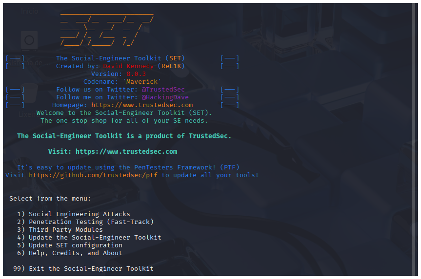
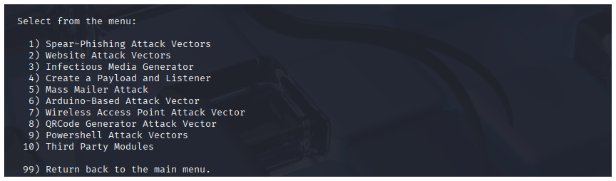
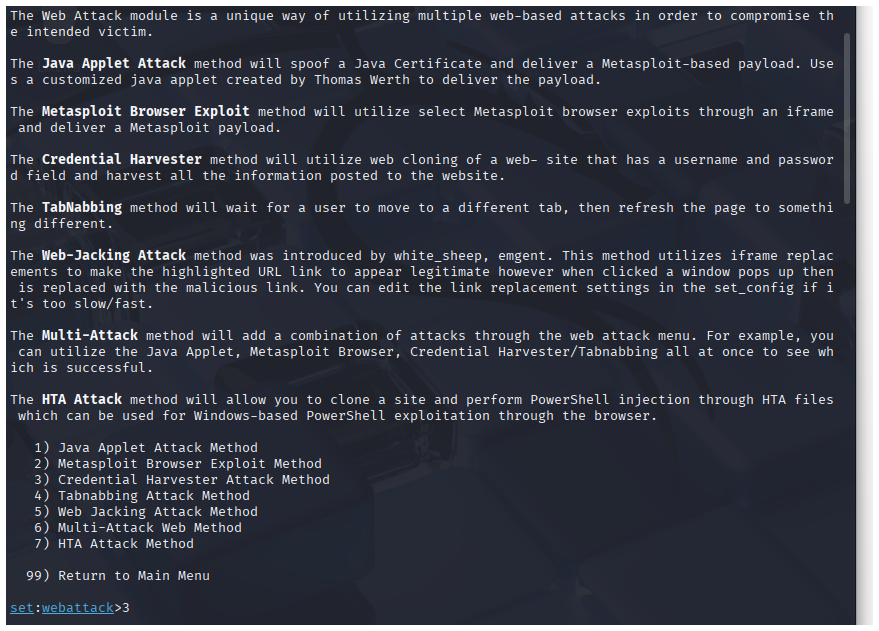
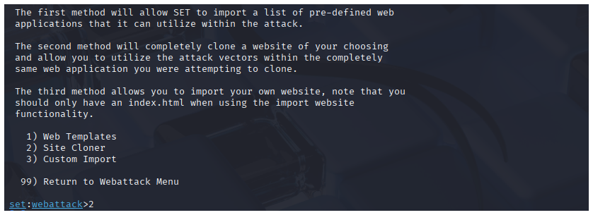
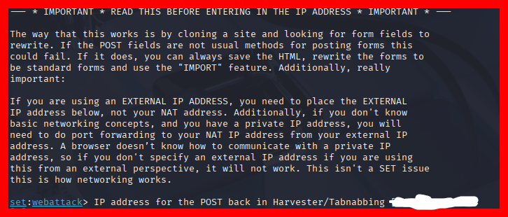
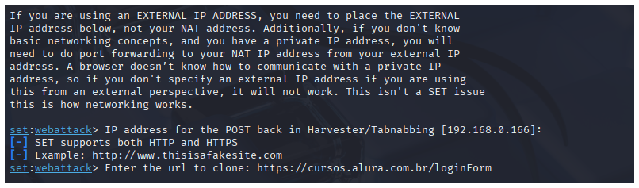
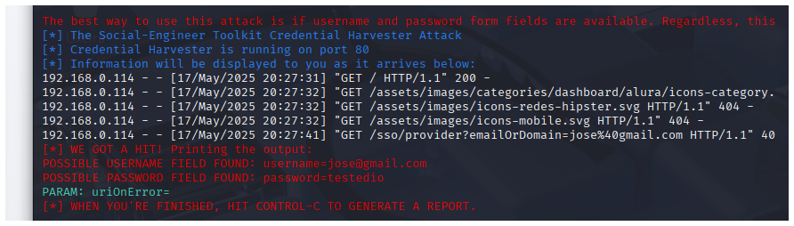

# Demonstração de Phishing Educacional - Página de Login da Alura

**AVISO LEGAL**: Este tutorial tem fins exclusivamente educacionais e de conscientização sobre segurança digital. O uso não autorizado desta técnica é crime. Execute apenas em ambientes controlados e com consentimento explícito.


## 📋 Pré-requisitos
- [Kali Linux](https://www.kali.org/) (sistema operacional para testes de penetração)
- **setoolkit** (pré-instalado no Kali Linux)
- Máquina virtual (recomendado) com configuração de rede em **Modo Bridge**

### Modo Bridge no VirtualBox
*(Exemplo: Configuração de rede > Modo Bridge no VirtualBox)*

---

## 🔧 Configuração da ferramenta SEToolkit

### 1. Acesso root no modo administrador
```bash
sudo su
```
### 2. inciar da ferramenta setoolkit com o comando:

```bash
setoolkit
```

### 3. Abrindo a ferramenta, selecione a opção "1" Social-Engineering Attacks.


### 4. Continuando, selecione a opção "2" Web Site Attack Vectors.


### 5. Continuando, selecione a opção "3" Credential Harvester Attack Method.


### 6. Continuando, selecione a opção "2" Site Cloner.


### 7. Para continuar com a configuração, a ferramenta identificará o IP que está rodando na máquina. A ferramenta usará a máquina como um servidor para receber os dados. Basta clicar no botão "Enter", e o IP da máquina aparecerá na tela.


### 8. O program irá solicitar a URL que irá clonar.


### 9. Após adicionar o URL, clique no botão "Enter". A configuração estará concluída. Basta compartilhar o IP com a pessoa desejada e aguardar o acesso à página. O programa receberá os dados automaticamente.


### Resultado

